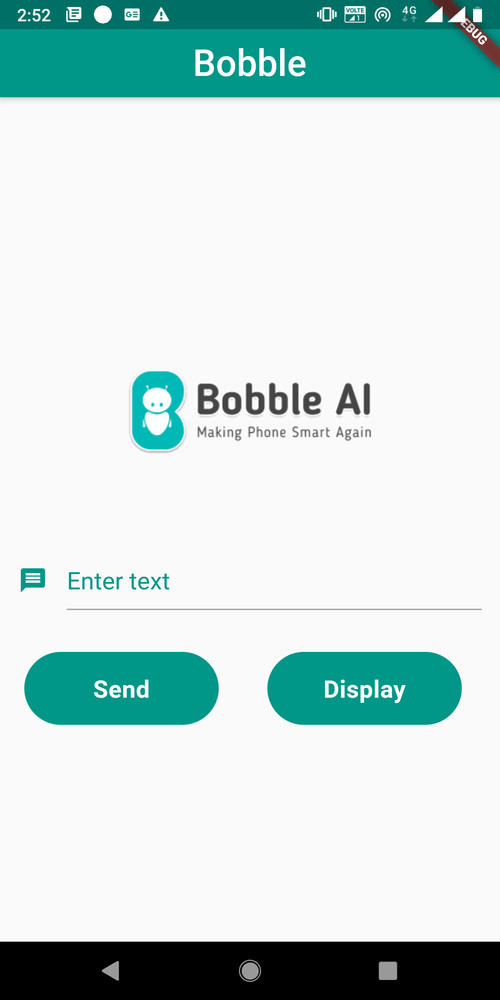
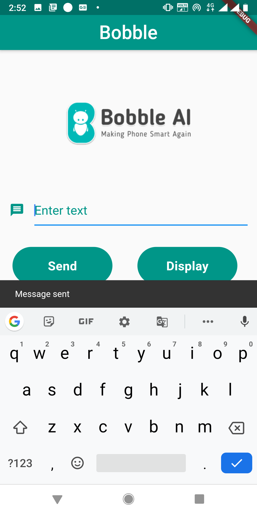

# Bobble

A new Flutter project.

##Flutter
Flutter is a cross-platform UI toolkit that is designed to allow code reuse across operating systems such as iOS and Android, while also allowing applications to interface directly with underlying platform services

